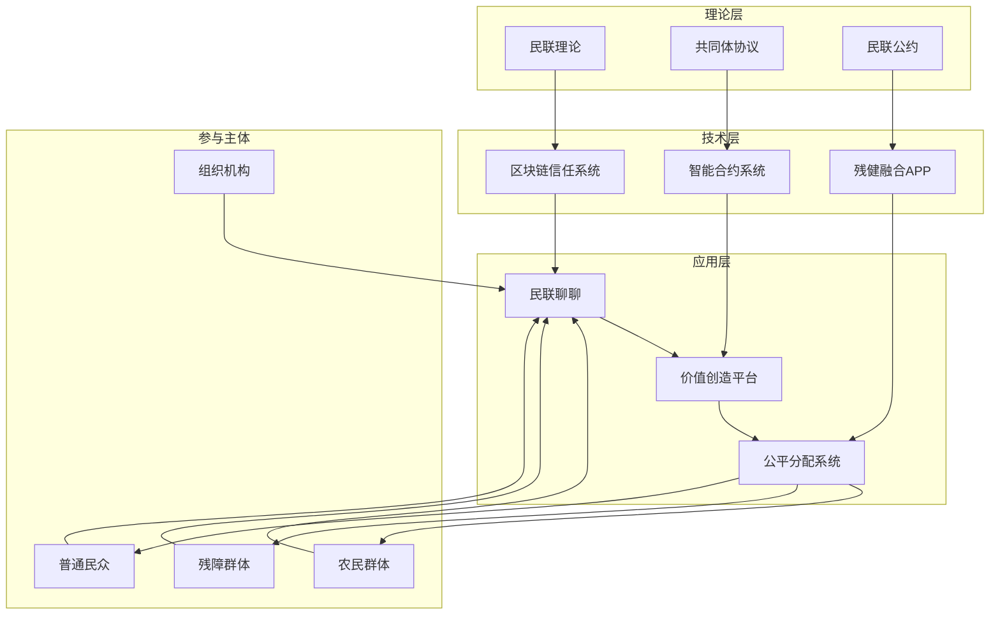

# 🏗️ 民联生态系统建设计划

## 🎯 核心愿景

构建一个**全国农民、残疾人与普通人共下一盘棋**的社会经济生态系统，通过共同体协议、民联公约、民联理论和民联社交功能，实现真正的价值共创和利益共享。

## 📋 系统架构概览



## 🎯 核心问题与解决方案

### ❌ 当前平台的核心问题

#### 1. **价值分配严重不公**
```typescript
// 当前平台价值分配（问题）
interface CurrentDistribution {
  userContribution: 100%      // 用户100%贡献
  platformRevenue: 100%      // 平台100%收入
  userReturn: 5-10%          // 用户仅获得5-10%回报
  platformProfit: 90-95%     // 平台获得90-95%利润
  
  // 问题：用户投入时间，平台获得大部分收益
}
```

#### 2. **虚假繁荣和低效回报**
- **时间浪费**: 用户大量时间投入，回报极低
- **价值错配**: 创造价值的人无法获得相应回报
- **不可持续**: 依赖资本输血，缺乏内生动力

### ✅ 民联生态系统解决方案

#### 1. **公平价值分配机制**
```typescript
// 民联生态系统价值分配（解决方案）
interface MinlianDistribution {
  userContribution: 100%           // 用户100%贡献
  totalValueCreated: 120%          // 通过协作创造120%价值
  
  distribution: {
    creatorShare: 60-80%          // 创作者获得60-80%
    platformOperation: 10-20%    // 平台运营成本10-20%
    developmentFund: 5-10%       // 技术发展基金5-10%
    publicWelfare: 5-10%         // 公共福利基金5-10%
  }
  
  // 核心原则：谁创造价值，谁获得回报
}
```

#### 2. **自产自销生态系统**
```typescript
interface SelfSufficientEcosystem {
  // 生产端
  production: {
    individualCreation: "个人内容创作"
    collaborativeProduction: "协作生产"
    toolEnhancedCreation: "工具增强创作"
    aiAssistedProduction: "AI辅助生产"
  }
  
  // 消费端
  consumption: {
    internalConsumption: "生态内消费"
    externalMarket: "外部市场销售"
    valueAddedServices: "增值服务"
    knowledgeProducts: "知识产品"
  }
  
  // 价值循环
  valueCycle: {
    creation → distribution → circulation → appreciation → creation
  }
}
```

## 🏗️ 核心组件设计

### 1. **共同体协议 (Community Agreement)**

#### 协议架构
```typescript
interface CommunityAgreement {
  // 基础原则
  fundamentalPrinciples: {
    mutualBenefit: "互利共赢 - 所有参与方都能获益"
    equalParticipation: "平等参与 - 每个人都有平等机会"
    valueSharing: "价值共享 - 公平分配创造的价值"
    sustainableDevelopment: "可持续发展 - 长期生态健康"
  }
  
  // 合作条件
  cooperationTerms: {
    contributionRequirements: "贡献要求 - 时间、技能、资源投入"
    benefitEntitlement: "收益权利 - 基于贡献的收益分配"
    obligationCompliance: "义务遵守 - 规则和标准执行"
    disputeResolution: "争议解决 - 冲突处理机制"
  }
  
  // 未来规则
  evolutionaryRules: {
    adaptiveGovernance: "适应性治理 - 根据发展调整规则"
    consensusBuilding: "共识建立 - 重要决策共识机制"
    protocolUpgrade: "协议升级 - 系统性改进流程"
    ecosystemExpansion: "生态扩展 - 新成员和新领域加入"
  }
}
```

#### 实施机制
```typescript
interface AgreementImplementation {
  // 技术实现
  technicalImplementation: {
    smartContractEncoding: "智能合约编码"
    blockchainExecution: "区块链执行"
    automatedEnforcement: "自动执行"
    transparentTracking: "透明追踪"
  }
  
  // 组织实现
  organizationalImplementation: {
    communityGovernance: "社区治理"
    monitoringCommittee: "监督委员会"
    arbitrationPanel: "仲裁小组"
    evolutionCouncil: "发展委员会"
  }
  
  // 激励实现
  incentiveImplementation: {
    rewardMechanism: "奖励机制"
    penaltySystem: "惩罚系统"
    reputationBuilding: "声誉建设"
    privilegeGranting: "特权授予"
  }
}
```

### 2. **民联公约 (Civil Union Covenant)**

#### 公约内容
```typescript
interface CivilUnionCovenant {
  // 参与主体定义
  participantDefinition: {
    farmers: {
      population: "农民群体"
      characteristics: "土地、生产技能、市场渠道需求"
      contributions: "农产品、传统知识、劳动力"
      expectations: "收入增长、技术支持、市场准入"
    }
    
    disabled: {
      population: "残障群体"
      characteristics: "特殊需求、多样化能力、创新思维"
      contributions: "独特视角、专业技能、坚韧品质"
      expectations: "平等机会、无障碍环境、价值实现"
    }
    
    ordinary: {
      population: "普通民众"
      characteristics: "多样化技能、消费能力、社会网络"
      contributions: "时间、技能、资源、网络"
      expectations: "价值回报、社会贡献、个人成长"
    }
  }
  
  // 约束条件
  bindingConditions: {
    rightsAndObligations: {
      basicRights: "基本权利 - 参与权、收益权、治理权"
      fundamentalObligations: "基本义务 - 贡献、合规、互助"
      conditionalRights: "条件权利 - 基于贡献的特殊权利"
      situationalObligations: "情境义务 - 特殊情况下的责任"
    }
    
    behavioralStandards: {
      ethicalConduct: "道德行为标准"
      professionalStandards: "专业行为标准"
    collaborativeNorms: "协作行为规范"
    conflictGuidelines: "冲突处理指导"
    }
    
    benefitSharing: {
      distributionFormula: "分配公式"
      adjustmentMechanism: "调整机制"
      specialCircumstances: "特殊情况处理"
      transparencyRequirements: "透明度要求"
    }
    
    riskSharing: {
      riskIdentification: "风险识别"
    responsibilityAllocation: "责任分配"
    mitigationMeasures: "缓解措施"
    compensationMechanism: "补偿机制"
    }
  }
}
```

### 3. **民联理论 (Civil Union Theory)**

#### 理论体系
```typescript
interface CivilUnionTheory {
  // 核心理论
  coreTheories: {
    yuanjuWelfareTheory: {
      concept: "圆聚济残理论"
      principles: "聚集资源、互助共赢、共同发展"
      implementation: "平台化、系统化、生态化"
      objectives: "残健融合、价值共创、社会和谐"
    }
    
    publicNetworkTheory: {
      concept: "公共网络理论"
      principles: "开放、共享、协作、共赢"
      architecture: "分布式、去中心化、自治"
      governance: "社区治理、民主决策、规则透明"
    }
    
    communitySystemTheory: {
      concept: "共同体系统理论"
      elements: "成员、关系、规则、目标"
      dynamics: "互动、学习、进化、创新"
      sustainability: "价值循环、能力建设、生态平衡"
    }
    
    blockchainTrustTheory: {
      concept: "区块链信任理论"
      mechanism: "技术信任、算法信任、代码信任"
      advantages: "透明、不可篡改、可追溯、自动化"
      applications: "合约执行、价值转移、身份验证"
    }
  }
  
  // 舆论战争策略
  opinionWarfareStrategy: {
    narrativeConstruction: {
      coreMessage: "共建共享、互利共赢"
      storytelling: "成功案例、感人故事、变革见证"
      valueProposition: "为什么选择民联生态系统"
      visionCommunication: "未来愿景和社会影响"
    }
    
    valuePropagation: {
      multiChannel: "线上线下、多平台传播"
      contentStrategy: "有价值内容、教育性内容、娱乐性内容"
      influencerStrategy: "意见领袖、专家支持、用户见证"
    communityBuilding: "社群运营、用户互动、口碑传播"
    }
    
    consensusBuilding: {
      dialoguePlatform: "对话平台、讨论论坛、决策机制"
      participatoryProcess: "参与式决策、民主协商、共识形成"
      conflictResolution: "争议调解、利益平衡、和谐发展"
      culturalIntegration: "文化融合、价值认同、社会和谐"
    }
    
    paradigmShift: {
      challengeOldModel: "挑战传统模式、指出问题所在"
      presentNewModel: "展示新模式、证明可行性"
      demonstrateSuccess: "成功案例、数据支撑、效果验证"
      scaleInfluence: "扩大影响、形成趋势、引领变革"
    }
  }
}
```

### 4. **民联聊聊 (Civil Union Chat)**

#### 社交功能设计
```typescript
interface CivilUnionChat {
  // 基础通信
  basicCommunication: {
    instantMessaging: {
      textChat: "文字聊天 - 支持富文本、表情、文件"
      voiceMessage: "语音消息 - 支持语音转文字"
      videoCall: "视频通话 - 支持多人视频、屏幕共享"
      fileTransfer: "文件传输 - 支持多种格式、大文件"
    }
    
    groupCommunication: {
      groupChat: "群聊 - 支持大群、主题群、临时群"
      broadcastChannel: "广播频道 - 一对多信息发布"
      discussionForum: "讨论论坛 - 主题讨论、投票决策"
      announcementSystem: "公告系统 - 重要信息推送"
    }
  }
  
  // 智能互动
  intelligentInteraction: {
    aiAssistant: {
      chatbot: "智能客服 - 24小时在线服务"
      translation: "实时翻译 - 多语言支持"
      contentGeneration: "内容生成 - 辅助创作、优化建议"
      emotionAnalysis: "情感分析 - 情绪识别、心理支持"
    }
    
    smartMatching: {
      interestMatching: "兴趣匹配 - 基于兴趣推荐好友"
      skillMatching: "技能匹配 - 基于技能推荐合作"
      opportunityMatching: "机会匹配 - 基于需求推荐机会"
      collaborationMatching: "协作匹配 - 基于项目推荐伙伴"
    }
  }
  
  // 价值创造社交
  valueCreationSocial: {
    collaborativeTools: {
      documentCollaboration: "文档协作 - 实时编辑、版本控制"
    projectManagement: "项目管理 - 任务分配、进度跟踪"
    knowledgeSharing: "知识分享 - 经验交流、技能传授"
    resourceExchange: "资源交换 - 时间、技能、物资交换"
    }
    
    economicActivities: {
      marketplace: "市场交易 - 商品、服务交易"
    servicePlatform: "服务平台 - 技能服务、咨询服务"
    crowdfunding: "众筹平台 - 项目众筹、产品预售"
    investmentPlatform: "投资平台 - 股权投资、债权投资"
    }
    
    learningDevelopment: {
      onlineCourses: "在线课程 - 技能培训、知识学习"
      mentorshipProgram: "导师计划 - 一对一指导、职业发展"
    peerLearning: "同伴学习 - 学习小组、知识分享"
    certificationSystem: "认证系统 - 技能认证、能力证明"
    }
  }
  
  // 社区治理
  communityGovernance: {
    participatoryDecision: {
      votingSystem: "投票系统 - 民主决策、意见征集"
    proposalSystem: "提案系统 - 改进建议、创新想法"
    deliberationPlatform: "协商平台 - 深度讨论、共识形成"
    feedbackMechanism: "反馈机制 - 意见收集、持续改进"
    }
    
    governanceStructure: {
      communityCouncil: "社区委员会 - 代表选举、决策执行"
    workingGroups: "工作组 - 专项任务、专业领域"
    reviewCommittee: "审查委员会 - 规则审查、争议仲裁"
    evolutionTeam: "发展团队 - 系统优化、功能升级"
    }
    
    ruleEnforcement: {
      monitoringSystem: "监督系统 - 行为监控、违规检测"
    reportingMechanism: "举报机制 - 问题举报、证据提交"
    penaltySystem: "惩罚系统 - 违规处理、权利限制"
    rehabilitationProgram: "改造计划 - 教育培训、重新融入"
    }
  }
}
```

## 🚀 实施策略

### 阶段一：理论构建和舆论准备（1-3个月）

#### 1.1 理论体系完善
```typescript
interface TheoryDevelopment {
  literatureReview: {
    existingModels: "现有模式研究"
    theoreticalFoundation: "理论基础构建"
    caseStudies: "案例分析"
    bestPractices: "最佳实践总结"
  }
  
  modelDesign: {
    conceptualFramework: "概念框架设计"
    logicalStructure: "逻辑结构构建"
    mathematicalModel: "数学模型建立"
    simulationValidation: "模拟验证"
  }
  
  expertValidation: {
    academicReview: "学术评审"
    industryFeedback: "行业反馈"
    userTesting: "用户测试"
    iterativeImprovement: "迭代改进"
  }
}
```

#### 1.2 舆论战争启动
```typescript
interface OpinionWarfareLaunch {
  contentStrategy: {
    coreNarrative: "核心叙事构建"
    storyLibrary: "故事库建设"
    valueProposition: "价值主张明确"
    visionCommunication: "愿景传播"
  }
  
  channelStrategy: {
    socialMedia: "社交媒体运营"
    contentPlatforms: "内容平台合作"
    traditionalMedia: "传统媒体合作"
    communityEvents: "社区活动"
  }
  
  influencerStrategy: {
    opinionLeaders: "意见领袖合作"
    expertEndorsement: "专家背书"
    userAdvocates: "用户倡导者"
    partnerPromotion: "合作伙伴推广"
  }
}
```

### 阶段二：协议制定和系统开发（3-6个月）

#### 2.1 法律框架建设
```typescript
interface LegalFramework {
  agreementDrafting: {
    legalConsultation: "法律咨询"
    contractDrafting: "合同起草"
    riskAssessment: "风险评估"
    complianceReview: "合规审查"
  }
  
  governanceStructure: {
    organizationalDesign: "组织设计"
    responsibilityDefinition: "责任定义"
    decisionProcess: "决策流程"
    accountabilityMechanism: "问责机制"
  }
  
  protectionMechanisms: {
    rightsProtection: "权益保护"
    disputeResolution: "争议解决"
    compensationSystem: "补偿系统"
    insuranceMechanism: "保险机制"
  }
}
```

#### 2.2 技术系统开发
```typescript
interface TechnicalDevelopment {
  blockchainInfrastructure: {
    platformSelection: "平台选择"
    smartContractDevelopment: "智能合约开发"
    consensusMechanism: "共识机制"
    securityAudit: "安全审计"
  }
  
  applicationDevelopment: {
    architectureDesign: "架构设计"
    frontendDevelopment: "前端开发"
    backendDevelopment: "后端开发"
    integrationTesting: "集成测试"
  }
  
  accessibilityFeatures: {
    universalDesign: "通用设计"
    assistiveTechnology: "辅助技术"
    multiModalInterface: "多模态界面"
    cognitiveSupport: "认知支持"
  }
}
```

### 阶段三：试点运行和生态建设（6-12个月）

#### 3.1 试点项目设计
```typescript
interface PilotProgram {
  participantSelection: {
    targetGroups: "目标群体选择"
    diversityConsideration: "多样性考虑"
    capacityAssessment: "能力评估"
    motivationAnalysis: "动机分析"
  }
  
  programDesign: {
    objectives: "目标设定"
    activities: "活动设计"
    timeline: "时间规划"
    metrics: "指标设计"
  }
  
  supportSystem: {
    trainingProgram: "培训计划"
    mentorshipSystem: "导师系统"
    technicalSupport: "技术支持"
    communityBuilding: "社区建设"
  }
}
```

#### 3.2 生态伙伴拓展
```typescript
interface EcosystemPartnership {
  partnerIdentification: {
    strategicPartners: "战略伙伴识别"
    complementaryResources: "互补资源分析"
    alignmentAssessment: "一致性评估"
    collaborationPotential: "合作潜力评估"
  }
  
  partnershipDevelopment: {
    negotiation: "合作谈判"
    agreementSigning: "协议签署"
    integrationPlanning: "整合规划"
    jointActivities: "联合活动"
  }
  
  valueCreation: {
    synergisticActivities: "协同活动"
    resourceSharing: "资源共享"
    marketExpansion: "市场扩展"
    innovationCollaboration: "创新合作"
  }
}
```

### 阶段四：规模化推广和系统完善（12-24个月）

#### 4.1 全国推广策略
```typescript
interface NationalScaling {
  geographicExpansion: {
    regionalPrioritization: "区域优先级"
    localAdaptation: "本地化适应"
    infrastructureDevelopment: "基础设施发展"
    capacityBuilding: "能力建设"
  }
  
  userAcquisition: {
    marketingCampaigns: "营销活动"
    referralPrograms: "推荐计划"
    communityOutreach: "社区外展"
    partnershipLeverage: "伙伴关系利用"
  }
  
  ecosystemMaturation: {
    networkEffects: "网络效应"
    valueCreation: "价值创造"
    sustainability: "可持续性"
    resilience: "韧性建设"
  }
}
```

#### 4.2 持续优化和进化
```typescript
interface ContinuousOptimization {
  performanceMonitoring: {
    kpiTracking: "关键指标跟踪"
    userFeedback: "用户反馈"
    systemPerformance: "系统性能"
    impactAssessment: "影响评估"
  }
  
  iterativeImprovement: {
    dataAnalysis: "数据分析"
    insightGeneration: "洞察生成"
    solutionDesign: "解决方案设计"
    implementationTesting: "实施测试"
  }
  
  evolutionaryGovernance: {
    ruleAdaptation: "规则适应"
    structureOptimization: "结构优化"
    processImprovement: "流程改进"
    cultureDevelopment: "文化发展"
  }
}
```

## 📊 成功指标和评估体系

### 1. **经济指标**
```typescript
interface EconomicIndicators {
  userIncome: {
    averageIncomeGrowth: "用户平均收入增长率"
    incomeDistribution: "收入分布情况"
    povertyReduction: "贫困减少率"
    economicMobility: "经济流动性"
  }
  
  platformPerformance: {
    gmvGrowth: "交易额增长率"
    userRetention: "用户留存率"
    transactionVolume: "交易量"
    revenueDistribution: "收益分配情况"
  }
  
  ecosystemHealth: {
    valueCreation: "价值创造总量"
    valueDistribution: "价值分配公平性"
    resourceUtilization: "资源利用率"
    sustainabilityIndex: "可持续性指数"
  }
}
```

### 2. **社会指标**
```typescript
interface SocialIndicators {
  inclusionMetrics: {
    participationRate: "参与率"
    diversityIndex: "多样性指数"
    accessibilityLevel: "无障碍水平"
    integrationDegree: "融合程度"
  }
  
  capacityBuilding: {
    skillImprovement: "技能提升"
    knowledgeAcquisition: "知识获取"
    confidenceBuilding: "信心建设"
    empowermentLevel: "赋权水平"
  }
  
  communityImpact: {
    socialCohesion: "社会凝聚力"
    trustLevel: "信任水平"
    cooperationFrequency: "合作频率"
    mutualSupport: "互助程度"
  }
}
```

### 3. **技术指标**
```typescript
interface TechnicalIndicators {
  systemPerformance: {
    availability: "系统可用性"
    responseTime: "响应时间"
    scalability: "可扩展性"
    securityLevel: "安全水平"
  }
  
  userExperience: {
    usabilityScore: "可用性评分"
    satisfactionRate: "满意度率"
    featureAdoption: "功能采用率"
    supportQuality: "支持质量"
  }
  
  innovationMetrics: {
    featureDevelopment: "功能开发速度"
    technologyAdoption: "技术采用率"
    processEfficiency: "流程效率"
    improvementRate: "改进率"
  }
}
```

## 🎯 关键成功要素

### 1. **理论指导实践**
- 完整的理论体系为实践提供指导
- 清晰的价值主张和愿景激励参与
- 强大的叙事能力传播理念

### 2. **技术保障信任**
- 区块链技术提供透明度和可信度
- 智能合约确保规则自动执行
- 无障碍技术确保平等参与

### 3. **组织支撑执行**
- 共同体协议建立行为规范
- 民联公约约束参与各方
- 有效治理机制确保公平

### 4. **用户价值驱动**
- 真正解决用户痛点
- 公平的价值分配机制
- 持续的能力建设支持

### 5. **生态系统思维**
- 多方参与，互利共赢
- 价值循环，可持续发展
- 网络效应，规模扩张

## 📝 结论

民联生态系统是一个革命性的社会经济创新，它将：

1. **重新定义价值创造** - 从资本驱动到用户驱动
2. **重构分配机制** - 从不公平分配到公平分享
3. **重建信任体系** - 从中心化信任到分布式信任
4. **重织社会网络** - 从原子化个体到有机共同体

这个系统如果成功实施，将不仅仅是解决公益问题，而是构建一个全新的社会经济范式，真正实现"全国农民和残疾人与普通人共下一盘棋"的愿景。

**关键在于开始行动**，从理论构建到实践验证，从小规模试点到全国推广，逐步实现这个宏伟的目标。