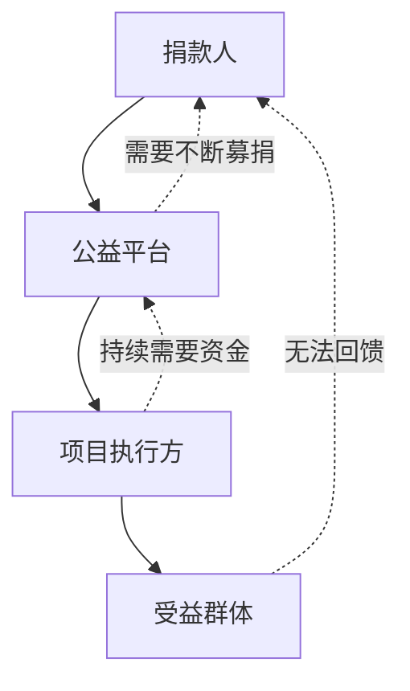
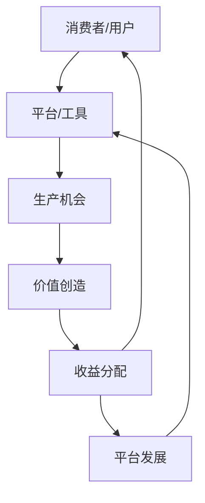

# 🔄 可持续商业模式分析报告

## 🎯 核心问题：装饰性公益 vs 实际价值创造

### ❌ 传统公益模式的问题

#### 1. **输血依赖症**


**问题分析**:
- 单向资金流动，无法形成闭环
- 受益群体被动接受，缺乏主动性
- 项目方依赖持续募捐，缺乏自我造血能力

#### 2. **价值错配**
- **捐款人**: 获得心理满足，但看不到实际影响
- **受益人**: 获得短期帮助，但缺乏长期发展能力
- **平台**: 获得手续费，但承担声誉风险

#### 3. **不可持续性**
- 资金来源不稳定
- 项目效果难以量化
- 无法规模化复制

## ✅ 可持续商业模式框架

### 1. **价值创造闭环**


**核心逻辑**:
- 消费者同时成为生产者
- 平台提供工具和基础设施
- 价值创造后收益共享
- 形成正向循环

### 2. **多层次价值体系**

#### 经济价值层
- **直接收益**: 用户通过平台获得收入
- **成本节约**: 共享基础设施降低成本
- **效率提升**: 工具化提高生产效率

#### 社会价值层
- **能力建设**: 用户技能提升
- **网络效应**: 社区互助网络
- **知识传播**: 经验和技能分享

#### 生态价值层
- **可持续发展**: 环保和社会责任
- **系统优化**: 整体资源配置效率
- **创新孵化**: 新模式和新机会

## 🚀 具体实施方案

### 1. **基建共建模式**

#### 技术基础设施
```typescript
// 共建技术平台架构
interface SharedInfrastructure {
  // 基础工具层
  tools: {
    communication: CommunicationTools
    collaboration: CollaborationTools
    payment: PaymentSystem
    analytics: AnalyticsSystem
  }
  
  // 资源共享层
  resources: {
    computing: ComputingResources
    storage: StorageResources
    bandwidth: BandwidthResources
    data: DataResources
  }
  
  // 价值分配层
  distribution: {
    revenue: RevenueSharing
    governance: GovernanceSystem
    reputation: ReputationSystem
  }
}
```

#### 实施策略
1. **模块化设计**: 每个模块可独立使用和组合
2. **API优先**: 开放接口，支持第三方集成
3. **微服务架构**: 弹性扩展，按需付费
4. **开源生态**: 社区共建，共享成果

### 2. **消费者-生产者一体化**

#### 角色转换机制
```typescript
interface User {
  id: string
  roles: UserRole[]
  
  // 消费者属性
  consumer: {
    needs: string[]
    preferences: UserPreferences
    budget: number
  }
  
  // 生产者属性
  producer: {
    skills: Skill[]
    resources: Resource[]
    capacity: number
    reputation: number
  }
  
  // 转换路径
  transformation: {
    available: TransformationPath[]
    completed: TransformationHistory[]
    potential: number
  }
}
```

#### 转换支持系统
1. **技能评估**: AI辅助的技能识别和评估
2. **培训体系**: 个性化学习路径推荐
3. **实践机会**: 小项目起步，逐步提升
4. **导师网络**: 经验用户指导新用户

### 3. **价值分配机制**

#### 多维度贡献评估
```typescript
interface Contribution {
  userId: string
  type: 'time' | 'skill' | 'resource' | 'network' | 'innovation'
  value: number
  impact: number
  
  // 价值量化
  quantification: {
    direct: number      // 直接经济价值
    indirect: number    // 间接社会价值
    potential: number   // 潜在未来价值
  }
  
  // 收益分配
  distribution: {
    immediate: number   // 即时收益
    recurring: number   // 持续收益
    equity: number      // 股权收益
  }
}
```

#### 分配原则
1. **多劳多得**: 基于贡献量的分配
2. **价值导向**: 基于价值创造能力的分配
3. **长期激励**: 股权和期权激励
4. **风险共担**: 风险与收益匹配

## 🎯 具体应用场景

### 1. **助残服务平台**

#### 传统模式问题
- 残障人士被动接受帮助
- 资金使用效率低下
- 无法实现自我价值

#### 新模式设计
```typescript
// 助残服务平台架构
interface DisabilityPlatform {
  // 能力评估
  assessment: {
    skills: SkillAssessment
    interests: InterestAnalysis
    potential: PotentialAnalysis
  }
  
  // 机会匹配
  matching: {
    jobs: JobMatching
    projects: ProjectMatching
    collaboration: CollaborationMatching
  }
  
  // 支持系统
  support: {
    training: TrainingSystem
    tools: AccessibilityTools
    mentorship: MentorshipNetwork
  }
  
  // 价值实现
  realization: {
    income: IncomeGeneration
    recognition: RecognitionSystem
    growth: GrowthPath
  }
}
```

### 2. **乡村振兴平台**

#### 传统慈善模式
- 单向资金援助
- 依赖外部输血
- 缺乏内生动力

#### 产业共建模式
```typescript
// 乡村振兴产业共建
interface RuralRevitalization {
  // 资源盘点
  resources: {
    land: LandResource
    labor: LaborResource
    culture: CulturalResource
    product: ProductResource
  }
  
  // 产业设计
  industries: {
    agriculture: SmartAgriculture
    tourism: RuralTourism
    culture: CulturalCreative
    ecommerce: RuralEcommerce
  }
  
  // 能力建设
  capacity: {
    training: SkillTraining
    technology: TechSupport
    marketing: MarketingSupport
    finance: FinancialServices
  }
  
  // 收益分配
  distribution: {
    villagers: VillagerIncome
    collective: CollectiveIncome
    platform: PlatformIncome
    public: PublicWelfare
  }
}
```

## 📊 成功指标体系

### 1. **经济指标**
- **收入增长率**: 用户收入增长情况
- **就业转化率**: 从消费者到生产者转化率
- **投资回报率**: 平台和用户投资回报
- **可持续性指数**: 不依赖外部输血的程度

### 2. **社会指标**
- **能力提升度**: 用户技能和能力提升
- **社会融入度**: 弱势群体社会融入情况
- **网络效应**: 用户间互助网络密度
- **创新活跃度**: 新模式和新机会产生

### 3. **生态指标**
- **资源利用率**: 共享资源使用效率
- **环境影响**: 可持续发展和环保贡献
- **系统健康度**: 整体生态系统健康状况
- **复制扩展性**: 模式复制和扩展能力

## 🔄 实施路径

### 阶段一：基础设施搭建（1-3个月）
1. **技术平台开发**: 核心功能模块开发
2. **种子用户招募**: 创始用户和合作伙伴
3. **试点项目启动**: 小规模验证模式
4. **数据收集分析**: 用户行为和效果数据

### 阶段二：模式验证（3-6个月）
1. **用户增长**: 扩大用户规模
2. **功能完善**: 基于反馈优化产品
3. **商业模式验证**: 收入模式验证
4. **合作伙伴拓展**: 生态伙伴建设

### 阶段三：规模化复制（6-12个月）
1. **地域扩展**: 向其他地区复制
2. **行业扩展**: 向其他行业扩展
3. **生态建设**: 完整生态系统建设
4. **影响力扩大**: 社会影响力最大化

## 🎯 核心成功要素

### 1. **价值导向**
- 始终以创造真实价值为核心
- 避免装饰性和表面化
- 注重长期可持续发展

### 2. **用户中心**
- 真正理解用户需求
- 赋能用户而非施舍
- 实现用户角色转换

### 3. **系统思维**
- 构建完整价值闭环
- 注重生态系统建设
- 实现多方共赢

### 4. **创新驱动**
- 模式创新和制度创新
- 技术创新和工具创新
- 持续迭代和优化

## 📝 结论

装饰性的公益项目确实存在根本性问题，无法实现真正的价值创造和可持续发展。真正的解决方案在于：

1. **从输血到造血**: 构建自我造血的商业生态
2. **从施舍到赋能**: 帮助用户实现价值创造
3. **从单向到闭环**: 建立价值创造和分配的完整闭环
4. **从装饰到实效**: 注重实际效果和长期影响

只有这样才能实现真正的互利共赢，让每个参与者都能获得救赎和发展的机会。